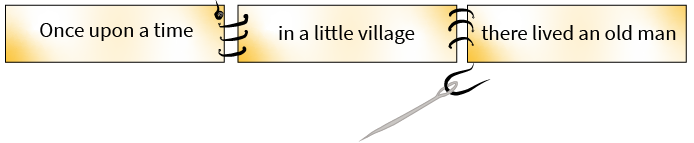
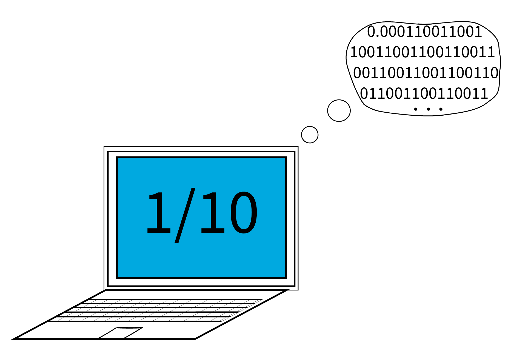
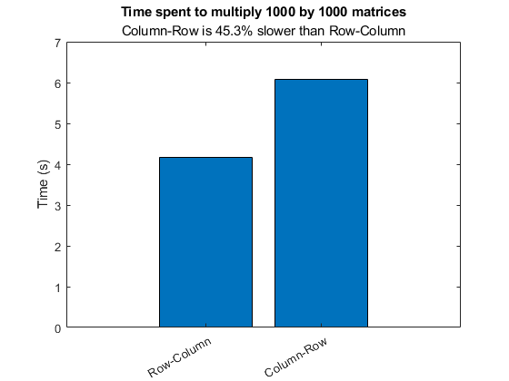

# Programming: Organizing Data        

 or 

**Curriculum Module**

_Created with R2022a. Compatible with R2022a and later releases._

# Information

This curriculum module contains interactive [MATLAB® live scripts](https://www.mathworks.com/products/matlab/live-editor.html) that teach fundamental concepts and basic terminology related to programming computers. This module focuses on concepts and practices related to working with data.

## Background

You can use these live scripts as demonstrations in lectures, class activities, or interactive assignments outside class. This module covers [textual](#H_F138D74D) data, [numerical](#H_2ED0A85B) data, [memory](#H_CD16DB7B), and [data structures](#H_666DEC5B) including, arrays, structs, tables, and more. Applications include sea surface temperature data and solar power generation data.

The instructions inside the live scripts will guide you through the exercises and activities. Get started with each live script by running it one section at a time. To stop running the script or a section midway (for example, when an animation is in progress), use the  Stop button in the **RUN** section of the **Live Editor** tab in the MATLAB Toolstrip.

## Contact Us

Solutions are available upon instructor request. Contact the [MathWorks teaching resources team](mailto:onlineteaching@mathworks.com) if you would like to request solutions, provide feedback, or if you have a question.

## Prerequisites

These scripts assume familiarity with MATLAB and general programming knowledge at the level covered in the [<u>Fundamentals of Programming</u>](https://www.mathworks.com/matlabcentral/fileexchange/103225-fundamentals-of-programming) interactive examples. You could also use [MATLAB Onramp](https://matlabacademy.mathworks.com/details/matlab-onramp/gettingstarted) as another resource to acquire familiarity with MATLAB.

## Getting Started
### Accessing the Module
### **On MATLAB Online:**

Use the  link to download the module. You will be prompted to log in or create a MathWorks account. The project will be loaded, and you will see an app with several navigation options to get you started.

### **On Desktop:**

Download or clone this repository. Open MATLAB, navigate to the folder containing these scripts and double-click on [OrganizingData.prj](https://matlab.mathworks.com/open/github/v1?repo=MathWorks-Teaching-Resources/Programming-Organizing-Data&project=OrganizingData.prj). It will add the appropriate files to your MATLAB path and open an app that asks you where you would like to start. 

Ensure you have all the required products ([listed below](#H_E850B4FF)) installed. If you need to include a product, add it using the Add-On Explorer. To install an add-on, go to the **Home** tab and select   **Add-Ons** > **Get Add-Ons**. 

## Products

MATLAB®, Mapping Toolbox™ (<samp>StoringData.mlx</samp>), Symbolic Math Toolbox™ (<samp>Strings.mlx</samp>)

# Scripts

## [**Strings.mlx**](https://matlab.mathworks.com/open/github/v1?repo=MathWorks-Teaching-Resources/Programming-Organizing-Data&project=OrganizingData.prj&file=Scripts/Strings.mlx) 
|  | **In this script, students will...** | **Summary**  |
| :-- | :-- | :-- |
|  | -  investigate the relationship between character arrays and Unicode values  -  try building two-dimensional character arrays and string arrays  -  format strings by concatenating, modifying capitalization, reordering characters, extracting or replacing substrings, or formatting textual data from numerical data.  -  extract the month from a regularly-formatted but randomly generated sentence | You can define, edit, format, and string together textual data for a computer. This script investigates strings, character arrays, and numeric data types and discusses how they interact in MATLAB. Formatting strings, modifying and extracting substrings, and building composite strings that include the results of numerical calculations are all explored.  |

## [**NumericDataTypes.mlx**](https://matlab.mathworks.com/open/github/v1?repo=MathWorks-Teaching-Resources/Programming-Organizing-Data&project=OrganizingData.prj&file=Scripts/NumericDataTypes.mlx) 
|  | **In this script, students will...** | **Summary**  |
| :-- | :-- | :-- |
|  | -  create an example illustrating the differences between floating point arithmetic and symbolic arithmetic.  -  explore the results of mathematical operations involving mixed numeric data types.  -  identify the possible values of a 32-bit unsigned integer.  -  use documentation to discover how to perform mathematical computations in MATLAB. | Different numeric data types are optimized for different operations. This script investigates the binary number system and how it leads to floating point, integer, and boolean data types.  |

## [**Memory.mlx**](https://matlab.mathworks.com/open/github/v1?repo=MathWorks-Teaching-Resources/Programming-Organizing-Data&project=OrganizingData.prj&file=Scripts/Memory.mlx) 
|  | **In this script, students will...** | **Summary**  |
| :-- | :-- | :-- |
|  | -  compare the results of computation organized in memory-efficient and memory-inefficient ways.  -  apply understanding of memory to recognize efficient computational patterns such as pre-allocation. | Understanding a little bit about how programs interact with memory can help you to write efficient programs or to understand why an algorithm might be much faster in some implementations than others. This script investigates high-level memory management and demonstrates how to write more memory-efficient code.  |

## [**StoringData.mlx**](https://matlab.mathworks.com/open/github/v1?repo=MathWorks-Teaching-Resources/Programming-Organizing-Data&project=OrganizingData.prj&file=Scripts/StoringData.mlx) 
|  | **In this script, students will...** | **Summary**  |
| :-- | :-- | :-- |
|  | -  read metadata to understand a dataset.  -  use arrays to store multidimensional data of the same type and access individual elements or sub-arrays using dimensional, logical or linear indexing.  -  use tables to store linked sets of different types of data such as key/value sets and extract information as tables, single variable arrays, or concatenated variable arrays.  -  use structure arrays to store linked data of different types and sizes and use dot notation to access fields within a structure array or variables within a table.  -  recognize cell arrays and extract the data to other data structures.  -  clean data by interpolating missing values.  -  answer questions by analyzing data.  -  convert data between types and structures. | Different data storage structures are optimized for different types of data and access. This script facilitates the exploration of arrays, tables, structure arrays, and cell arrays as structures for storing data. Examples include sea surface temperature data and solar power generation data.  |

# License

The license for this module is available in the [LICENSE.md](https://github.com/MathWorks-Teaching-Resources/Programming-Organizing-Data/blob/release/LICENSE.md).

# Related Courseware Modules
| **Courseware Module** | **Sample Content** | **Available on:**  |
| :-- | :-- | :-- |
| [**Programming: Structuring Code**](https://www.mathworks.com/matlabcentral/fileexchange/115905-programming-structuring-code)   Learn how to organize your code into functions, debug, comment, and share |  |  [GitHub](https://github.com/MathWorks-Teaching-Resources/Programming-Structuring-Code)  |
|  [**Programming: A Starter Project Using MATLAB and Python**](https://www.mathworks.com/matlabcentral/fileexchange/116490-programming-a-starter-project-using-matlab-and-python)   Use MATLAB, Python, and the OpenWeather API together to implement a weather prediction dashboard |  |    [GitHub](https://github.com/MathWorks-Teaching-Resources/Programming-A-Starter-Project-Using-MATLAB-and-Python)  |

**Introductory content:**

-  [**Fundamentals of Programming**](https://www.mathworks.com/matlabcentral/fileexchange/103225-fundamentals-of-programming) is available on  or  or [GitHub](https://github.com/MathWorks-Teaching-Resources/Fundamentals-of-Programming) 
-  [**Treasure Hunt Game: Learn to Code**](https://www.mathworks.com/matlabcentral/fileexchange/123265-treasure-hunt) is available on  or  or [GitHub](https://github.com/MathWorks-Teaching-Resources/Treasure-Hunt) 

Or feel free to explore our other [modular courseware content](https://www.mathworks.com/matlabcentral/fileexchange/?q=tag%3A%22courseware+module%22&sort=downloads_desc_30d).

# Educator Resources
-  [Educator Page](https://www.mathworks.com/academia/educators.html) 

# Contribute 

Looking for more? Find an issue? Have a suggestion? Please contact the [MathWorks teaching resources team](mailto:%20onlineteaching@mathworks.com). If you want to contribute directly to this project, you can find information about how to do so in the [CONTRIBUTING.md](https://github.com/MathWorks-Teaching-Resources/Programming-Organizing-Data/blob/release/CONTRIBUTING.md) page on GitHub.

 *©* Copyright 2023 The MathWorks™, Inc

